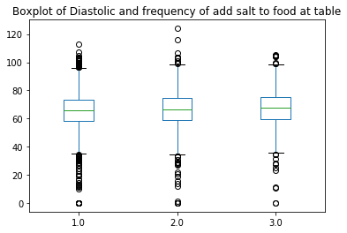
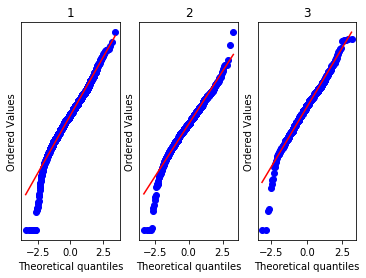

```{r, echo=FALSE, eval = FALSE}
# Stats 506, Fall 2019
# Group project, R version: Jingyan Lu
#
# This script contains the script for implementing a R tutorial for the final
# group project for the course Stats 506, Fall 2019. 
# The script implements a moderation and mediation model for finding the effects 
# of salt intake behaviour on the blood pressure (both diastole and systole) of 
# a person with waist size and age acting as moderator and mediator respectively. 
# Author: Jingyan Lu (andrealu@umich.edu)
# Date: December 11, 2019
```

```{r setup, include=FALSE}
knitr::opts_chunk$set(echo = TRUE, warning = FALSE)
knitr::opts_knit$set(root.dir = normalizePath('D:/STAT506/Group project/stats506'))
#libraries:
#library(SASxport)
library(tidyverse)
library(data.table)
library(MBESS)
library(kableExtra)
# set working directory
setwd("D:/STAT506/Group project/stats506")

```


# Introduction

Our project aims to answer the question:
"Is salt intake associated with blood pressure? If so, to what extent is that relationship mediated or moderated by age or waist size?" 

By raising the question, we want to know whether the salt intake behavior of a person is related to the person's blood pressure levels and want to know further if this relationship is dependent on the waist measurement of the person.

The analysis would be a moderation analysis testing whether there exists a relationship between salt intake and blood pressure levels and if this relationship is moderated by waist measurement.

As a follow up analysis, we will study "whether the salt intake habit of a person is related to the person's blood pressure levels and identify whether age is a mechanism underlying the relationship between the two", i.e., is age a mediator between the relationship between salt intake and blood pressure levels? This would be a mediation analysis with a confidence interval-based bootstrapping approach.
<br>
  
# Data
  
We use [NHANES](https://wwwn.cdc.gov/nchs/nhanes/continuousnhanes/default.aspx) data in 2015-2016 for analysis. Data of salt intake and people's diastole and systole blood pressure are needed in both moderation and mediation analysis. You can find them in the datasets [Dietary Interview - Total Nutient intakes, First Day](https://wwwn.cdc.gov/Nchs/Nhanes/2015-2016/DR1TOT_I.htm), [Blood Pressure](https://wwwn.cdc.gov/Nchs/Nhanes/2015-2016/BPX_I.htm) respectively.
  
For the moderation analysis, we use another dataset [Body Measures](https://wwwn.cdc.gov/Nchs/Nhanes/2015-2016/BMX_I.htm) for data of waist measurement.
  
For the mediation analysis, data of participants' age from [Demographic variables and Sample Weights](https://wwwn.cdc.gov/Nchs/Nhanes/2015-2016/DEMO_I.htm) is used.
<br>
```{r, echo = FALSE}
name = c("DBD100", "DI", "SY", "RIDAGEYR", "BMXWAIST")
description = c("How often add salt to food at table", 
                "Diastolic: Mean of blood pressure from three times reading (mm Hg)", 
                "Systole: Mean of blood pressure from three times reading (mm Hg)", 
                "Age in years at screeening", 
                "Wasit circumference (cm)")
dataset = c("DR1TOT_I.XPT", "BPX_I.XPT", "BPX_I.XPT", "DEMO_I.XPT", "BMX_I.XPT")
data.table(Variables = name, Descriptions = description, Datasets = dataset) %>%
  knitr::kable(align = "l") %>%
  kable_styling(bootstrap_options = c("striped", "hover"), latex_options = c("hold_position", "scale_down"), position = "left")
```


# Methods

Moderation and Mediation analysis are used in our projects. To explain the moderation analysis, We start with the relationship between an independent variable x and a dependent variable Y. For example, in our case, X is the salt intake and Y is the blood pressure. we will prove it later that there is a relationship between them, which can be expressed as $y = \beta_0 + \beta_1 x + \epsilon$.

A moderator Z is a variable that can affect the direction or strength of the relationship between X and Y. If the effect of salt intake on the blood pressure depends on the level of waist size, then waist size is a moderator. Otherwise, blood pressure is not a moderator.

We perform moderation analysis by adding interaction term, which can be expressed as $y = \beta_0 + \beta_1 x + \beta_2 z + \beta_3 x * z + \epsilon$. If $\beta_3$ does not equal to 0, Z is supposed to be a moderator. In the regression model, we test whether the regression coefficient for the interaction term is significant or not.

Mediator explains the underlying mechanism of the relationship between independent variable and dependent variable. Let's assume that the independent variable X is a predictor for the dependent variable Y and the relationship is that X boosts Y. If M is a mediator, then the hypothesis is that X boosts M and then M boosts Y. Three steps of regression comprise a medation analysis: X to Y, X to M, X+M to Y. 

First, we need to illustrate that X affects Y. If not, there is no need to mediate. Second, we try to figure out if X affect M. If there is no relationship between them, M may be another predictor or does not affect Y at all, instead of a mediator. M is a mediator only when there is relationship between X and M. The last step is to find if M affects Y, but X no longer affects Y. If the medation effect exists, the effect of X on Y will disappear or reduce to a samll magnitude when M is included in the model.

We use R, Python and SAS to perform the analysis.


  
# Core Analysis: Moderation and Mediation {.tabset}


## R
  
### Load the data

```{r}
# read data
demographics<-readxl::read_xlsx('RawData/demographics_15_16.xlsx')
BMI<-readxl::read_xlsx('RawData/Body_measures_2015_16.xlsx')
blood_pressure<-readxl::read_xlsx('RawData/Blood_Pressure_2015_16.xlsx')
nutrients_1day<-readxl::read_xlsx('RawData/Dietary_nutrients_firstday_2015_16.xlsx')
```

  
### Data processing
  
```{r}
blood_pressure = blood_pressure %>%
  select(SEQN, BPXSY1, BPXSY2, BPXSY3, BPXDI1, BPXDI2, BPXDI3) %>%
  rowwise() %>%
  mutate(DI = mean(c(BPXDI1, BPXDI2, BPXDI3), na.rm=TRUE),
         SY = mean(c(BPXSY1, BPXSY2, BPXSY3), na.rm = TRUE)) %>%
  select(SEQN, DI, SY)

demographics = demographics %>% 
  select(SEQN, RIDAGEYR)

nutrients_1day = nutrients_1day %>%
  select(SEQN, DBD100)

BMI = BMI %>%
  select(SEQN, BMXWAIST)

data = demographics %>%
  left_join(BMI, by = "SEQN") %>%
  left_join(nutrients_1day, by = "SEQN") %>%
  left_join(blood_pressure, by = "SEQN") 


data = data[complete.cases(data), ]
```

```{r plots}

df=data %>%
  na.omit() %>%
  filter(DBD100!=9,DI>0,SY>0) %>%
  mutate(DBD100=as.character(DBD100)) %>%
  mutate(DBD100=ifelse(DBD100=='1','Rarely',
                       ifelse(DBD100=='2','Occasionally',
                              'Very often')))%>%
  mutate(DBD100=as.factor(DBD100))

summary(df)

ggplot(data=df,aes(x=DBD100))+
  geom_boxplot(aes(y=DI))+
  ggtitle("Boxplot of Diastolic and frequency of add salt to food at table")

ggplot(data=df,aes(x=DBD100))+
  geom_boxplot(aes(y=SY))+
  ggtitle("Boxplot of Systolic and frequency of add salt to food at table")

model_DI = lm(DI ~ DBD100, data)
qqnorm(model_DI$residuals)
qqline(model_DI$residuals, col = "blue")

model_SY = lm(SY ~ DBD100, data)
qqnorm(model_SY$residuals)
qqline(model_SY$residuals, col = "blue")

```

#### Center means to reduce multicolinearity

```{r}
data[c("RIDAGEYR", "BMXWAIST", "DBD100", "DI", "SY")] = 
  lapply(data[c("RIDAGEYR", "BMXWAIST", "DBD100", "DI", "SY")],  
         function(x) scale(x, center=TRUE, scale=FALSE))

summary(data)
```
<br>
  
### Analyse the relationship between salt intake and two kinds of blood pressure
<br>
  
#### For diastole blood pressure
  
```{r}
model_DI = lm(DI ~ DBD100, data)
summary(model_DI)
```
<br>
  
#### For systole blood pressure
  
```{r}
model_SY = lm(SY ~ DBD100, data)
summary(model_SY)
```


##### Both p-values are less than 0.001, which show strong evidence that salt intake have siginificant influence on both kinds of blood pressure.
<br>
  
### Moderation part

The structural model for the moderation analysis can be defined as seen in Figure 1


##### We perform moderation to test if the relationship is dependent on the waist size. Three levels of a moderator(mean, one standard deviation above the mean and one standard deviation below the mean) is chosen.
 <br>

#### Moderation at mean for diastole blood pressure
  
```{r}
moderation_DI = lm(DI ~ DBD100 + BMXWAIST + DBD100 * BMXWAIST, data)
summary(moderation_DI)
```
<br>
  
#### Moderation at one standard deviation above mean for diastole blood pressure
  
```{r}
data$BMXWAIST_high = data$BMXWAIST + sd(data$BMXWAIST)
moderation_DI_high = lm(DI ~ DBD100 + BMXWAIST_high + DBD100 * BMXWAIST_high, data)
summary(moderation_DI_high)
```
<br>
  
#### Modetation at one standard deviation below mean for diastole blood pressure
  
```{r}
data$BMXWAIST_low = data$BMXWAIST - sd(data$BMXWAIST)
moderation_DI_low = lm(DI ~ DBD100 + BMXWAIST_low + DBD100 * BMXWAIST_low, data)
summary(moderation_DI_low)
```


##### Since the regression coefficient for the interation term is not significant with p value 0.41, there does not exist a significant moderation effect. The effect of salt intake on diastole blood pressure may not depend on waist size.


  
#### Moderation at mean for systole blood pressure
  
```{r}
moderation_SY = lm(SY ~ DBD100 + BMXWAIST + DBD100 * BMXWAIST, data)
summary(moderation_SY)
```

  
#### Moderation at one standard deviation above mean for systole blood pressure
  
```{r}
data$BMXWAIST_high = data$BMXWAIST + sd(data$BMXWAIST)
moderation_SY_high = lm(SY ~ DBD100 + BMXWAIST_high + DBD100 * BMXWAIST_high, data)
summary(moderation_SY_high)
```
<br>
  
#### Moderation at one standard deviation below mean for diastole blood pressure
  
```{r}
data$BMXWAIST_low = data$BMXWAIST - sd(data$BMXWAIST)
moderation_SY_low = lm(SY ~ DBD100 + BMXWAIST_low + DBD100 * BMXWAIST_low, data)
summary(moderation_SY_low)
```


##### Since the regression coefficient for the interation term is not significant with p value 0.51, there does not exist a significant moderation effect. The effect of salt intake on systole blood pressure may not depend on waist size as well.


  
### Mediation Part
  
##### We perform mediation to test if the relationship between salt intake and blood pressure mediated by age.
##### First, we test if there is relationship between age and salt intake, since mediation makes sense only if they have relationship.
  
```{r}
age_salt_DI = lm(RIDAGEYR ~ DBD100, data)
summary(age_salt_DI)
```


##### The p_value is 5.31e-10. They have strong relationship.
<br>
  
#### Second, perform the mediation analysis
<br>
  
##### For diastole blood pressure
  
```{r}
mediation_DI = lm(DI ~ DBD100 + RIDAGEYR, data)
summary(mediation_DI)
```


#### Third, perform the mediation through bootstrapping
<br>
  
##### For diastole blood pressure
  
```{r}
mediation_boot_DI1 = mediation(x = data$DBD100, 
                               mediator = data$RIDAGEYR,
                               dv = data$DI,
                               conf.level = 0.95,
                               bootstrap = TRUE,
                               B = 1000, 
                               which.boot = "Percentile")
```

```{r}
mediation_boot_DI1
```
##### The indirect effect (0.37655) and its confidence interval is different from zero. Age is a mediator between salt intake and diastole blood pressure.
<br>
  


##### The effect of salt intake on diastole blood pressure still exists(p-value is 0.021), but in a smaller magnitude. Age partially mediates between salt intake and diastole blood pressure.
<br>

##### For systole blood pressure
  
```{r}
mediation_SY = lm(SY ~ DBD100 + RIDAGEYR, data)
summary(mediation_SY)
```

##### The effect of salt intake on systole blood pressure disappear (p-value is 0.741). Age fully mediates salt intake and systole blood pressure.
<br>
  
#### Perform the mediation through bootstrapping for systole
```{r}
mediation_boot_SY1 = mediation(x = data$DBD100, 
                               mediator = data$RIDAGEYR,
                               dv = data$SY,
                               conf.level = 0.95,
                               bootstrap = TRUE,
                               B = 1000, 
                               which.boot = "Percentile")
```

```{r}
mediation_boot_SY1
```


##### The estimate indirect effect(1.054) and its confidence interval is different from zero. Age is a mediator between salt intake and systole blood pressure.


## SAS

```{r, echo = TRUE, eval=FALSE}
 /* 
Stats 506, Fall 2019
 Group project, SAS version: __Anon

 This script contains the script for implementing a SAS tutorial for the final
 group project for the course Stats 506, Fall 2019. 
 The script implements a moderation and mediation model for finding the effects 
 of salt intake behaviour on the blood pressure (both diastole and systole) of 
 a person with waist size and age acting as moderator and mediator respectively. 
 Author: ___Anon (___@umich.edu)
 Date: December 11, 2019
*/
```

```{r, echo = TRUE, eval=FALSE}
/* libraries */
libname results './results';
libname rawdata './RawData';
libname home './home';
```


### Load the data

```{r, echo = TRUE, eval=FALSE}

%let demographics = './demographics_15_16.csv';
%let BMI = './Body_measures_2015_16.csv';
%let blood_pressure = './Blood_Pressure_2015_16.csv';
%let nutrients_1day = './Dietary_nutrients_firstday_2015_16.csv';

/* Import demographic data */ 
proc import file = &demographics 
out=home.demographics dbms=csv replace; 
guessingrows=max; 
getnames = Yes ; 
run;

/* Import BMI data */ 
proc import file = &BMI   
out=home.BMI dbms=csv replace; 
guessingrows=max;
getnames = Yes ;
run;

/* Import blood pressure data */ 
proc import file = &blood_pressure   
out=home.blood_pressure  dbms=csv replace; 
guessingrows=max;
getnames = Yes ;
run;

/* Import nutrients data */ 
proc import file = &nutrients_1day   
out=home.nutrients_1day  dbms=csv replace; 
guessingrows=max;
getnames = Yes ;
run;

```
<br>
  
### Data processing
  
```{r, echo = TRUE, eval = FALSE}
/* Merge all required data with SEQN as key*/ 
proc sql;
create table home.merged_data as select 
A.SEQN, A.RIDAGEYR, 
B.BMXWAIST, 
C.DBD100,
D.BPXSY1, D.BPXSY2, D.BPXSY3, D.BPXDI1, D.BPXDI2, D.BPXDI3 from
home.demographics as A inner join 
home.BMI as B on 
A.SEQN = B.SEQN inner join 
home.nutrients_1day as C on 
A.SEQN = C.SEQN inner join 
home.blood_pressure as D on
A.SEQN = D.SEQN;
quit;

/* Find mean of systole and diastole from all three observations*/ 
data home.mean_merged_data(DROP=BPXSY1 BPXSY2 BPXSY3 BPXDI1 BPXDI2 BPXDI3);
set home.merged_data;
BPXSY=mean(of BPXSY1-BPXSY3);
BPXDI=mean(of BPXDI1-BPXDI3);
run;

/* Drop rows with missing values*/ 
data home.mean_merged_data;
set home.mean_merged_data;
if not cmiss(BMXWAIST,DBD100,BPXSY,BPXDI);
run;

```

#### Center means to reduce multicolinearity

```{r, echo = TRUE, eval = FALSE}
proc sql; 
create table home.mean_centered_data as
select SEQN,
RIDAGEYR - mean(RIDAGEYR) as RIDAGEYRmc, 
BMXWAIST - mean(BMXWAIST) as BMXWAISTmc,
DBD100 - mean(DBD100) as DBD100mc,
BPXDI - mean(BPXDI) as BPXDImc,
BPXSY - mean(BPXSY) as BPXSYmc
from home.mean_merged_data;
quit;
```
<br>
  
#### Create the moderator variables at one SD above and below mean and the interaction terms  
```{r, echo = TRUE, eval = FALSE}
/* Create + and - one SD of the dependent variable for moderation analysis */ 
proc sql;
create table home.mean_centered_data as 
select *, 
BMXWAISTmc - std(BMXWAISTmc) as BMXWAISTlow,
BMXWAISTmc + std(BMXWAISTmc) as BMXWAISThigh  
from home.mean_centered_data;
quit; 

/* Create the interaction term for use in the moderator model */ 
data home.mean_centered_data;
set home.mean_centered_data;
DBD100mc_BMXWAISTmc=DBD100mc*BMXWAISTmc;
DBD100mc_BMXWAISTlow=DBD100mc*BMXWAISTlow;
DBD100mc_BMXWAISThigh=DBD100mc*BMXWAISThigh;
run;

```
### Analyse the relationship between salt intake and two kinds of blood pressure
<br>
  
#### For diastole blood pressure
  
```{r, echo = TRUE, eval = FALSE}
proc reg data= home.mean_centered_data;
model BPXDImc = DBD100mc;
title ' Regression model / testing relationship between Diastole and salt intake' ;
run; 
```

<br>
  
#### For systole blood pressure
  
```{r, echo = TRUE, eval = FALSE}
proc reg data= home.mean_centered_data;
model BPXSYmc = DBD100mc;
title ' Regression model / testing relationship between Systole and salt intake' ;
run; 
```


<br>

##### Both p-values are less than 0.001, which show strong evidence that salt intake have siginificant influence on both kinds of blood pressure.
<br>
  
### Moderation part
  
##### We perform moderation to test if the relationship is dependent on the waist size. Three levels of a moderator(mean, one standard deviation above the mean and one standard deviation below the mean) are chosen.
<br>
  
#### Moderation at mean for diastole blood pressure
  
```{r, echo = TRUE, eval = FALSE}
proc reg data=home.mean_centered_data;
model BPXDImc = DBD100mc BMXWAISTmc DBD100mc_BMXWAISTmc / pcorr2 scorr2;
title ' Regression model / testing moderator effect of waist size on diastole and salt intake at mean' ;
run;
```

<br>

<br>
  
#### Moderation at one standard deviation above mean for diastole blood pressure
  
```{r, echo = TRUE, eval = FALSE}
proc reg data=home.mean_centered_data;
model BPXDImc = DBD100mc BMXWAISTmc DBD100mc_BMXWAISThigh / pcorr2 scorr2;
title ' Regression model / testing moderator effect of waist size on diastole and salt intake one SD above mean' ;
run;
```

<br>

<br>
  
#### Moderation at one standard deviation below mean for diastole blood pressure
  
```{r, echo = TRUE, eval = FALSE}
proc reg data=home.mean_centered_data;
model BPXDImc = DBD100mc BMXWAISTlow DBD100mc_BMXWAISTlow / pcorr2 scorr2;
title ' Regression model / testing moderator effect of waist size on diastole and salt intake one SD below mean' ;
run;
```


<br>

##### Since the regression coefficient for the interation term is not significant with p value 0.41, there does not exist a significant moderation effect. The effect of salt intake on diastole blood pressure may not depend on waist size.

<br>
  
  
#### Moderation at mean for systole blood pressure
  
```{r, echo = TRUE, eval = FALSE}
proc reg data=home.mean_centered_data;
model BPXSYmc = DBD100mc BMXWAISTmc DBD100mc_BMXWAISTmc / pcorr2 scorr2;
title ' Regression model / testing moderator effect of waist size on systole and salt intake at mean' ;
run;
```


<br>
  
#### Moderation at one standard deviation above mean for systole blood pressure
  
```{r, echo = TRUE, eval = FALSE}
proc reg data=home.mean_centered_data;
model BPXSYmc = DBD100mc BMXWAISThigh DBD100mc_BMXWAISThigh / pcorr2 scorr2;
title ' Regression model / testing moderator effect of waist size on systole and salt intake one SD above mean' ;
run;
```


<br>
  
  
#### Moderation at one standard deviation below mean for systole blood pressure
  
```{r, echo = TRUE, eval = FALSE}
proc reg data=home.mean_centered_data;
model BPXSYmc = DBD100mc BMXWAISTlow DBD100mc_BMXWAISTlow / pcorr2 scorr2;
title ' Regression model / testing moderator effect of waist size on systole and salt intake one SD below mean' ;
run;
```


##### Since the regression coefficient for the interation term is not significant with p value 0.51, there does not exist a significant moderation effect. The effect of salt intake on systole blood pressure may not depend on waist size as well.
<br>

  
### Mediation Part
  
##### We perform mediation to test if the relationship between salt intake and blood pressure mediated by age.
##### First, we test if there is relationship between age and salt intake, since mediation makes sense only if they have relationship.
  
```{r, echo = TRUE, eval = FALSE}
proc reg data = home.mean_centered_data;
model RIDAGEYRmc = DBD100mc; 
title ' Regression model / Checking relationship between age and salt intake' ;
run;
```


##### The p_value is 5.31e-10. They have strong relationship.
<br>
  
#### Second, perform the mediation 
<br>
  
##### For diastole blood pressure
  
```{r, echo = TRUE, eval = FALSE}
proc causalmed data=home.mean_centered_data;
model BPXDImc = DBD100mc RIDAGEYRmc;
mediator RIDAGEYRmc = DBD100mc;
title ' Regression model / check the effect of age as a mediator between the relationship of Diastolic BP and salt intake' ;
run;
```


##### The effect of salt intake on diastole blood pressure still exists(p-value is 0.021), but in a smaller magnitude. Age partially mediates between salt intake and diastole blood pressure.
<br>
  
##### For systole blood pressure
  
```{r, echo = TRUE, eval = FALSE}
proc causalmed data=home.mean_centered_data;
model BPXSYmc = DBD100mc RIDAGEYRmc;
mediator RIDAGEYRmc = DBD100mc;
title ' Regression model / check the effect of age as a mediator between the relationship of Systolic BP and salt intake' ;
run;
```


##### The effect of salt intake on systole blood pressure disappear (p-value is 0.741). Age fully mediates salt intake and systole blood pressure.
<br>
  
#### Third, perform the mediation through bootstrapping
<br>
  
##### For diastole blood pressure
  
```{r, echo = TRUE, eval = FALSE}
proc causalmed data=home.mean_centered_data;
model BPXDImc = DBD100mc RIDAGEYRmc;
mediator RIDAGEYRmc = DBD100mc;
bootstrap NBOOT = 1000;
title ' Regression model / check the effect of age as a mediator between the relationship of Diastolic BP and salt intake using bootstrap' ;
run;
```


##### The indirect effect (0.37655) and its confidence interval is different from zero. Age is a mediator between salt intake and diastole blood pressure.
<br>
  
##### For systole blood pressure
  
```{r, echo = TRUE, eval = FALSE}
proc causalmed data=home.mean_centered_data;
model BPXSYmc = DBD100mc RIDAGEYRmc;
mediator RIDAGEYRmc = DBD100mc;
bootstrap NBOOT = 1000;
title ' Regression model / check the effect of age as a mediator between the relationship of Systolic BP and salt intake using bootstrap' ;
run;
```


##### The estimate indirect effect(1.054) and its confidence interval is different from zero. Age is a mediator between salt intake and systole blood pressure.


## Python


Required software and packages to run the code are as follows:

* Python3 
* os
* pandas
* numpy
* scipy
* statsmodels
* patsy
* matplotlib

```python
#Stats 506, Fall 2019
 #Group project, Python version: Xinjun Li

 #This script contains the script for implementing a Python tutorial for the final
 #group project for the course Stats 506, Fall 2019. 
 #The script implements a moderation and mediation model for finding the effects 
 #of salt intake behaviour on the blood pressure (both diastole and systole) of 
 #a person with waist size and age acting as moderator and mediator respectively. 
 #Author: Xinjun Li (lixinjun@umich.edu)
 #Date: December 11, 2019

```

```python
# Import packages
import os
import pandas as pd
import numpy as np
from scipy import stats
from statsmodels.formula.api import ols
from statsmodels.stats.anova import anova_lm
import patsy
import statsmodels.api as sm
from statsmodels.stats.mediation import Mediation
import matplotlib.pyplot as plt
```


```python
# Set working directory
os.chdir('D:/学习/密歇根/STAT506/Group project/stats506/')

# read data
demo = pd.read_excel("RawData/Demographics_15_16.xlsx")
BMI = pd.read_excel("RawData/Body_measures_2015_16.xlsx")
bp = pd.read_excel('RawData/Blood_Pressure_2015_16.xlsx')
nutr = pd.read_excel("RawData/Dietary_nutrients_firstday_2015_16.xlsx")
```

### Data cleaning

We need first clean the raw data and join different dataset.


```python
# select useful columns

demo=demo.set_index('SEQN'
                    ).filter(items=['RIDAGEYR']  
                    ).dropna()
BMI=BMI.set_index('SEQN'
                  ).filter(items=['BMXWAIST']   
                  ).dropna()

nutr1=nutr.set_index('SEQN'
                    ).filter(items=['DBD100']
                    ).dropna(
                    )
                    
nutr=nutr1.query('DBD100 != 9'
                ).astype('category')

# Calculate mean of blood pressure
bp=bp.set_index('SEQN'
                ).filter(regex='(BPXSY*)|(BPXDI*)')
bp=bp.assign(SY=bp.filter(regex='BPXSY*').mean(axis=1, skipna = True),
             DI=bp.filter(regex='BPXDI*').mean(axis=1, skipna = True)
             ).filter(items=['SY','DI']).dropna()

# Merge all data set
df1=bp.join(demo,how='inner').join(BMI,how='inner').join(nutr1,how='inner')
df1=df1-df1.mean()

# Categorical treat DBD100 as categorical variable.
df=bp.join(demo,how='inner').join(BMI,how='inner').join(nutr,how='inner')
```

Generate plots show the relationship between salt intake behaviors and blood presure.


```python
# plot Diastolic and salt intakes
DI_salt=df[['DBD100','DI']
            ].pivot(columns='DBD100', values='DI'
            )
DI_salt.columns=["Rarely","Occasionally","Very often"]
DI_salt.boxplot(grid=False)
plt.title("Boxplot of Diastolic and frequency of add salt to food at table")
plt.suptitle("")
plt.show()
```





```python
# plot Systolic and salt intakes
SY_salt=df[['DBD100','SY']
            ].pivot(columns='DBD100', values='SY'
            )
SY_salt.columns=["Rarely","Occasionally","Very often"]
SY_salt.boxplot(grid=False)
plt.title("Boxplot of Systolic and frequency of add salt to food at table")
plt.suptitle("")
plt.show()
```


```python
# Test normality of Diastolic given salt intake
ax1 = plt.subplot(131)
a=DI_salt[['Rarely']].dropna().to_numpy()
a=np.reshape(a,(len(a)))
qqplot = stats.probplot(a, plot=plt)
plt.yticks([])

ax2 = plt.subplot(132)
b=DI_salt[['Occasionally']].dropna().to_numpy()
b=np.reshape(b,(len(b)))
qqplot = stats.probplot(b, plot=plt)
plt.yticks([])

ax3 = plt.subplot(133)
c=DI_salt[['Very often']].dropna().to_numpy()
c=np.reshape(c,(len(c)))
qqplot = stats.probplot(c, plot=plt)
plt.yticks([])

ax1.set_title('Rarely')
ax2.set_title('Occasionally')
ax3.set_title('Very often')

plt.show()
```





```python
# Test normality of Systolic given salt intake
ax1 = plt.subplot(131)
a=SY_salt[['Rarely']].dropna().to_numpy()
a=np.reshape(a,(len(a)))
qqplot = stats.probplot(a, plot=plt)
plt.yticks([])

ax2 = plt.subplot(132)
b=SY_salt[['Occasionally']].dropna().to_numpy()
b=np.reshape(b,(len(b)))
qqplot = stats.probplot(b, plot=plt)
plt.yticks([])

ax3 = plt.subplot(133)
c=SY_salt[['Very often']].dropna().to_numpy()
c=np.reshape(c,(len(c)))
qqplot = stats.probplot(c, plot=plt)
plt.yticks([])

ax1.set_title('Rarely')
ax2.set_title('Occasionally')
ax3.set_title('Very often')

plt.show()
```


### Fit OLS

Now fit the ordinary least square to the data.
The models used are:
`DI ~ DBD100` and `SY ~ DBD100`

#### Diastolic result


```python
# fit ols to Diastolic measurements
ols_DI=ols('DI~DBD100',data=df1).fit()
# Print the summary
print(ols_DI.summary())
```

                                OLS Regression Results                            
    ==============================================================================
    Dep. Variable:                     DI   R-squared:                       0.003
    Model:                            OLS   Adj. R-squared:                  0.003
    Method:                 Least Squares   F-statistic:                     14.87
    Date:                Thu, 12 Dec 2019   Prob (F-statistic):           0.000117
    Time:                        02:02:32   Log-Likelihood:                -18776.
    No. Observations:                4682   AIC:                         3.756e+04
    Df Residuals:                    4680   BIC:                         3.757e+04
    Df Model:                           1                                         
    Covariance Type:            nonrobust                                         
    ==============================================================================
                     coef    std err          t      P>|t|      [0.025      0.975]
    ------------------------------------------------------------------------------
    Intercept   3.759e-14      0.195   1.93e-13      1.000      -0.383       0.383
    DBD100         0.8862      0.230      3.856      0.000       0.436       1.337
    ==============================================================================
    Omnibus:                      523.351   Durbin-Watson:                   2.000
    Prob(Omnibus):                  0.000   Jarque-Bera (JB):             1559.833
    Skew:                          -0.592   Prob(JB):                         0.00
    Kurtosis:                       5.568   Cond. No.                         1.18
    ==============================================================================
    

    

#### Systolic result


```python
# fit ols to Systolic measurements
ols_SY=ols('SY~DBD100',data=df1).fit()
# Print the summary
print(ols_SY.summary())
```

                                OLS Regression Results                            
    ==============================================================================
    Dep. Variable:                     SY   R-squared:                       0.003
    Model:                            OLS   Adj. R-squared:                  0.003
    Method:                 Least Squares   F-statistic:                     14.68
    Date:                Thu, 12 Dec 2019   Prob (F-statistic):           0.000129
    Time:                        01:37:13   Log-Likelihood:                -19985.
    No. Observations:                4682   AIC:                         3.997e+04
    Df Residuals:                    4680   BIC:                         3.999e+04
    Df Model:                           1                                         
    Covariance Type:            nonrobust                                         
    ==============================================================================
                     coef    std err          t      P>|t|      [0.025      0.975]
    ------------------------------------------------------------------------------
    Intercept    119.4778      0.253    472.714      0.000     118.982     119.973
    DBD100         0.9597      0.250      3.831      0.000       0.469       1.451
    ==============================================================================
    Omnibus:                      831.965   Durbin-Watson:                   1.965
    Prob(Omnibus):                  0.000   Jarque-Bera (JB):             1619.248
    Skew:                           1.081   Prob(JB):                         0.00
    Kurtosis:                       4.905   Cond. No.                         1.04
    ==============================================================================

    

From the above results, we know that both models are significant and every coefficients are significant(at the level of 95%).

### Moderation effect of waist size


First, add two columns recording a standiviation above and below  of waist size.


```python
df1['waist_sd'] = df1['BMXWAIST'].std()
df1['waist_up']=df1['BMXWAIST']+df1['waist_sd']
df1['waist_down']=df1['BMXWAIST']-df1['waist_sd']
```

#### Diastolic result

Fit model: `DI ~ DBD100 + BMXWAIST + DBD100 * BMXWAIST`


```python
moderation_DI = ols('DI ~ DBD100 + BMXWAIST + DBD100 * BMXWAIST', data=df1).fit()
print(moderation_DI.summary())
```

                                OLS Regression Results                            
    ==============================================================================
    Dep. Variable:                     DI   R-squared:                       0.090
    Model:                            OLS   Adj. R-squared:                  0.090
    Method:                 Least Squares   F-statistic:                     154.6
    Date:                Thu, 12 Dec 2019   Prob (F-statistic):           1.65e-95
    Time:                        02:14:56   Log-Likelihood:                -18563.
    No. Observations:                4682   AIC:                         3.713e+04
    Df Residuals:                    4678   BIC:                         3.716e+04
    Df Model:                           3                                         
    Covariance Type:            nonrobust                                         
    ===================================================================================
                          coef    std err          t      P>|t|      [0.025      0.975]
    -----------------------------------------------------------------------------------
    Intercept           0.0101      0.187      0.054      0.957      -0.356       0.376
    DBD100              0.5903      0.220      2.682      0.007       0.159       1.022
    BMXWAIST            0.2074      0.010     21.095      0.000       0.188       0.227
    DBD100:BMXWAIST    -0.0100      0.012     -0.825      0.409      -0.034       0.014
    ==============================================================================
    Omnibus:                      645.708   Durbin-Watson:                   2.006
    Prob(Omnibus):                  0.000   Jarque-Bera (JB):             2203.551
    Skew:                          -0.685   Prob(JB):                         0.00
    Kurtosis:                       6.069   Cond. No.                         22.5
    ==============================================================================
    


```python
# one standard deviation above mean
moderation_DI_up = ols('DI ~ DBD100 + waist_up + DBD100 * waist_up', data=df1).fit()
print(moderation_DI_up.summary())
```

                                OLS Regression Results                            
    ==============================================================================
    Dep. Variable:                     DI   R-squared:                       0.090
    Model:                            OLS   Adj. R-squared:                  0.090
    Method:                 Least Squares   F-statistic:                     154.6
    Date:                Thu, 12 Dec 2019   Prob (F-statistic):           1.65e-95
    Time:                        02:15:04   Log-Likelihood:                -18563.
    No. Observations:                4682   AIC:                         3.713e+04
    Df Residuals:                    4678   BIC:                         3.716e+04
    Df Model:                           3                                         
    Covariance Type:            nonrobust                                         
    ===================================================================================
                          coef    std err          t      P>|t|      [0.025      0.975]
    -----------------------------------------------------------------------------------
    Intercept          -3.9335      0.265    -14.866      0.000      -4.452      -3.415
    DBD100              0.7800      0.313      2.488      0.013       0.165       1.394
    waist_up            0.2074      0.010     21.095      0.000       0.188       0.227
    DBD100:waist_up    -0.0100      0.012     -0.825      0.409      -0.034       0.014
    ==============================================================================
    Omnibus:                      645.708   Durbin-Watson:                   2.006
    Prob(Omnibus):                  0.000   Jarque-Bera (JB):             2203.551
    Skew:                          -0.685   Prob(JB):                         0.00
    Kurtosis:                       6.069   Cond. No.                         45.7
    ==============================================================================
    


```python
# one standard deviation below mean
moderation_DI_down = ols('DI ~ DBD100 + waist_down + DBD100 * waist_down', data=df1).fit()
print(moderation_DI_down.summary())
```

                                OLS Regression Results                            
    ==============================================================================
    Dep. Variable:                     DI   R-squared:                       0.090
    Model:                            OLS   Adj. R-squared:                  0.090
    Method:                 Least Squares   F-statistic:                     154.6
    Date:                Thu, 12 Dec 2019   Prob (F-statistic):           1.65e-95
    Time:                        02:15:11   Log-Likelihood:                -18563.
    No. Observations:                4682   AIC:                         3.713e+04
    Df Residuals:                    4678   BIC:                         3.716e+04
    Df Model:                           3                                         
    Covariance Type:            nonrobust                                         
    =====================================================================================
                            coef    std err          t      P>|t|      [0.025      0.975]
    -------------------------------------------------------------------------------------
    Intercept             3.9537      0.264     14.975      0.000       3.436       4.471
    DBD100                0.4007      0.323      1.240      0.215      -0.233       1.034
    waist_down            0.2074      0.010     21.095      0.000       0.188       0.227
    DBD100:waist_down    -0.0100      0.012     -0.825      0.409      -0.034       0.014
    ==============================================================================
    Omnibus:                      645.708   Durbin-Watson:                   2.006
    Prob(Omnibus):                  0.000   Jarque-Bera (JB):             2203.551
    Skew:                          -0.685   Prob(JB):                         0.00
    Kurtosis:                       6.069   Cond. No.                         47.1
    ==============================================================================
    


For the models above, coefficients for the interaction terms and salt intake itself are not significant(at level of 95%).
There are not moderation effect of waist size on salt intake and diastole.

#### Systolic result

Fit model: `SY ~ DBD100 + BMXWAIST + DBD100 * BMXWAIST`


```python
moderation_SY = ols('SY ~ DBD100 + BMXWAIST + DBD100 * BMXWAIST', data=df1).fit()
print(moderation_SY.summary())
```

                                OLS Regression Results                            
    ==============================================================================
    Dep. Variable:                     SY   R-squared:                       0.177
    Model:                            OLS   Adj. R-squared:                  0.176
    Method:                 Least Squares   F-statistic:                     334.6
    Date:                Thu, 12 Dec 2019   Prob (F-statistic):          7.40e-197
    Time:                        02:15:37   Log-Likelihood:                -19537.
    No. Observations:                4682   AIC:                         3.908e+04
    Df Residuals:                    4678   BIC:                         3.911e+04
    Df Model:                           3                                         
    Covariance Type:            nonrobust                                         
    ===================================================================================
                          coef    std err          t      P>|t|      [0.025      0.975]
    -----------------------------------------------------------------------------------
    Intercept          -0.0099      0.230     -0.043      0.966      -0.461       0.441
    DBD100              0.6140      0.271      2.265      0.024       0.083       1.145
    BMXWAIST            0.3802      0.012     31.400      0.000       0.356       0.404
    DBD100:BMXWAIST     0.0098      0.015      0.657      0.511      -0.019       0.039
    ==============================================================================
    Omnibus:                     1182.376   Durbin-Watson:                   1.970
    Prob(Omnibus):                  0.000   Jarque-Bera (JB):             3374.829
    Skew:                           1.317   Prob(JB):                         0.00
    Kurtosis:                       6.218   Cond. No.                         22.5
    ==============================================================================
    
  


```python
# one standard deviation above mean
moderation_SY_up = ols('SY ~ DBD100 + waist_up + DBD100 * waist_up', data=df1).fit()
print(moderation_SY_up.summary())
```

                                OLS Regression Results                            
    ==============================================================================
    Dep. Variable:                     SY   R-squared:                       0.177
    Model:                            OLS   Adj. R-squared:                  0.176
    Method:                 Least Squares   F-statistic:                     334.6
    Date:                Thu, 12 Dec 2019   Prob (F-statistic):          7.40e-197
    Time:                        02:15:58   Log-Likelihood:                -19537.
    No. Observations:                4682   AIC:                         3.908e+04
    Df Residuals:                    4678   BIC:                         3.911e+04
    Df Model:                           3                                         
    Covariance Type:            nonrobust                                         
    ===================================================================================
                          coef    std err          t      P>|t|      [0.025      0.975]
    -----------------------------------------------------------------------------------
    Intercept          -7.2380      0.326    -22.215      0.000      -7.877      -6.599
    DBD100              0.4279      0.386      1.109      0.268      -0.329       1.185
    waist_up            0.3802      0.012     31.400      0.000       0.356       0.404
    DBD100:waist_up     0.0098      0.015      0.657      0.511      -0.019       0.039
    ==============================================================================
    Omnibus:                     1182.376   Durbin-Watson:                   1.970
    Prob(Omnibus):                  0.000   Jarque-Bera (JB):             3374.829
    Skew:                           1.317   Prob(JB):                         0.00
    Kurtosis:                       6.218   Cond. No.                         45.7
    ==============================================================================
    


```python
# one standard deviation below mean
moderation_SY_down = ols('SY ~ DBD100 + waist_down + DBD100 * waist_down', data=df1).fit()
print(moderation_SY_down.summary())
```

                                OLS Regression Results                            
    ==============================================================================
    Dep. Variable:                     SY   R-squared:                       0.177
    Model:                            OLS   Adj. R-squared:                  0.176
    Method:                 Least Squares   F-statistic:                     334.6
    Date:                Thu, 12 Dec 2019   Prob (F-statistic):          7.40e-197
    Time:                        02:16:32   Log-Likelihood:                -19537.
    No. Observations:                4682   AIC:                         3.908e+04
    Df Residuals:                    4678   BIC:                         3.911e+04
    Df Model:                           3                                         
    Covariance Type:            nonrobust                                         
    =====================================================================================
                            coef    std err          t      P>|t|      [0.025      0.975]
    -------------------------------------------------------------------------------------
    Intercept             7.2183      0.325     22.203      0.000       6.581       7.856
    DBD100                0.8001      0.398      2.011      0.044       0.020       1.580
    waist_down            0.3802      0.012     31.400      0.000       0.356       0.404
    DBD100:waist_down     0.0098      0.015      0.657      0.511      -0.019       0.039
    ==============================================================================
    Omnibus:                     1182.376   Durbin-Watson:                   1.970
    Prob(Omnibus):                  0.000   Jarque-Bera (JB):             3374.829
    Skew:                           1.317   Prob(JB):                         0.00
    Kurtosis:                       6.218   Cond. No.                         47.1
    ==============================================================================
    


For the models above, coefficients for the interation terms and salt intake itself are not significant(at level of 95%). 
There are not moderation effect of waist size on salt intake and diastole.

### Mediation effect of age

Fit model: `RIDAGEYR ~ DBD100` to see if there are relationships between age and salt intake


```python
# test if there is relationship between age and salt intake.
age_D = ols('RIDAGEYR ~ DBD100', data=df1).fit()
print(age_D.summary())
```

                                OLS Regression Results                            
    ==============================================================================
    Dep. Variable:               RIDAGEYR   R-squared:                       0.008
    Model:                            OLS   Adj. R-squared:                  0.008
    Method:                 Least Squares   F-statistic:                     38.72
    Date:                Thu, 12 Dec 2019   Prob (F-statistic):           5.31e-10
    Time:                        02:20:09   Log-Likelihood:                -21011.
    No. Observations:                4682   AIC:                         4.203e+04
    Df Residuals:                    4680   BIC:                         4.204e+04
    Df Model:                           1                                         
    Covariance Type:            nonrobust                                         
    ==============================================================================
                     coef    std err          t      P>|t|      [0.025      0.975]
    ------------------------------------------------------------------------------
    Intercept  -8.743e-16      0.314  -2.78e-15      1.000      -0.616       0.616
    DBD100         2.3047      0.370      6.223      0.000       1.579       3.031
    ==============================================================================
    Omnibus:                     1898.788   Durbin-Watson:                   2.043
    Prob(Omnibus):                  0.000   Jarque-Bera (JB):              326.001
    Skew:                           0.345   Prob(JB):                     1.62e-71
    Kurtosis:                       1.907   Cond. No.                         1.18
    ==============================================================================
    


The model is significant. There are relationships between age and salt intake behavior.

#### Diastolic result

Fit model: `DI ~ DBD100 + RIDAGEYR`.


```python
mediation_DI = ols('DI ~ DBD100 + RIDAGEYR', data=df1).fit()
print(mediation_DI.summary())
```

                                OLS Regression Results                            
    ==============================================================================
    Dep. Variable:                     DI   R-squared:                       0.072
    Model:                            OLS   Adj. R-squared:                  0.072
    Method:                 Least Squares   F-statistic:                     182.8
    Date:                Thu, 12 Dec 2019   Prob (F-statistic):           3.64e-77
    Time:                        02:20:17   Log-Likelihood:                -18608.
    No. Observations:                4682   AIC:                         3.722e+04
    Df Residuals:                    4679   BIC:                         3.724e+04
    Df Model:                           2                                         
    Covariance Type:            nonrobust                                         
    ==============================================================================
                     coef    std err          t      P>|t|      [0.025      0.975]
    ------------------------------------------------------------------------------
    Intercept   3.759e-14      0.188      2e-13      1.000      -0.369       0.369
    DBD100         0.5091      0.223      2.287      0.022       0.073       0.946
    RIDAGEYR       0.1636      0.009     18.698      0.000       0.146       0.181
    ==============================================================================
    Omnibus:                      725.164   Durbin-Watson:                   2.008
    Prob(Omnibus):                  0.000   Jarque-Bera (JB):             2678.882
    Skew:                          -0.745   Prob(JB):                         0.00
    Kurtosis:                       6.393   Cond. No.                         25.5
    ==============================================================================
    

The model is significant. Age might be a mediator between salt intake and diastolic.


```python
# origin model and mediator model
med_model_DI=sm.OLS.from_formula('DI ~ RIDAGEYR+DBD100', data=df1)
mediator_DI=sm.OLS.from_formula('RIDAGEYR ~ DBD100', data=df1)

# origin model and mediator model
med_DI = Mediation(med_model_DI,mediator_DI,'DBD100','RIDAGEYR').fit()
print(med_DI.summary())
```

                              Estimate  Lower CI bound  Upper CI bound  P-value
    ACME (control)            0.378793        0.198924        0.563067    0.000
    ACME (treated)            0.378793        0.198924        0.563067    0.000
    ADE (control)             0.493689        0.059676        0.900952    0.026
    ADE (treated)             0.493689        0.059676        0.900952    0.026
    Total effect              0.872482        0.416557        1.328894    0.000
    Prop. mediated (control)  0.426604        0.245650        0.855243    0.000
    Prop. mediated (treated)  0.426604        0.245650        0.855243    0.000
    ACME (average)            0.378793        0.198924        0.563067    0.000
    ADE (average)             0.493689        0.059676        0.900952    0.026
    Prop. mediated (average)  0.426604        0.245650        0.855243    0.000
    

All the mediation effect(ACME) are significant(at level of 95%).
Which means that age is a mediator between salt intake and diastolic.

#### Systolic result

Fit model: `SY ~ DBD100 + RIDAGEYR`.


```python
mediation_SY = ols('SY ~ DBD100 + RIDAGEYR', data=df1).fit()
print(mediation_SY.summary())
```

                                OLS Regression Results                            
    ==============================================================================
    Dep. Variable:                     SY   R-squared:                       0.327
    Model:                            OLS   Adj. R-squared:                  0.326
    Method:                 Least Squares   F-statistic:                     1134.
    Date:                Thu, 12 Dec 2019   Prob (F-statistic):               0.00
    Time:                        02:23:41   Log-Likelihood:                -19067.
    No. Observations:                4682   AIC:                         3.814e+04
    Df Residuals:                    4679   BIC:                         3.816e+04
    Df Model:                           2                                         
    Covariance Type:            nonrobust                                         
    ==============================================================================
                     coef    std err          t      P>|t|      [0.025      0.975]
    ------------------------------------------------------------------------------
    Intercept  -2.212e-14      0.208  -1.07e-13      1.000      -0.407       0.407
    DBD100         0.0853      0.246      0.348      0.728      -0.396       0.567
    RIDAGEYR       0.4575      0.010     47.405      0.000       0.439       0.476
    ==============================================================================
    Omnibus:                      584.285   Durbin-Watson:                   1.955
    Prob(Omnibus):                  0.000   Jarque-Bera (JB):             1238.816
    Skew:                           0.763   Prob(JB):                    9.87e-270
    Kurtosis:                       5.005   Cond. No.                         25.5
    ==============================================================================
    


The model is significant. 
Even thought the coefficients of salt intake is not significant(at level of 95%).
Age might be a mediator between salt intake and systolic.


```python
# origin model and mediator model
med_model_SY=sm.OLS.from_formula('SY ~ RIDAGEYR+DBD100', data=df1)
mediator_SY=sm.OLS.from_formula('RIDAGEYR ~ DBD100', data=df1)

# origin model and mediator model
med_SY = Mediation(med_model_SY,mediator_SY,'DBD100','RIDAGEYR').fit()
print(med_SY.summary())
```

                              Estimate  Lower CI bound  Upper CI bound  P-value
    ACME (control)            1.034208        0.525030        1.529603    0.000
    ACME (treated)            1.034208        0.525030        1.529603    0.000
    ADE (control)             0.093089       -0.367313        0.540152    0.720
    ADE (treated)             0.093089       -0.367313        0.540152    0.720
    Total effect              1.127297        0.430358        1.775847    0.004
    Prop. mediated (control)  0.918998        0.604010        1.648115    0.004
    Prop. mediated (treated)  0.918998        0.604010        1.648115    0.004
    ACME (average)            1.034208        0.525030        1.529603    0.000
    ADE (average)             0.093089       -0.367313        0.540152    0.720
    Prop. mediated (average)  0.918998        0.604010        1.648115    0.004
    

All the mediation effect(ACME) are significant.
Which means that age is a mediator between salt intake and systolic.


# Additional Analysis {.tabset}

## R


#### Simple Slope analysis for diastole blood pressure

  
##### We find beta0 and beta1 values of the independent variable DBD100 (salt intake) from the three regression models: (1) with the moderator held at mean (2) with the moderator held at one standard deviation below mean (3) with the moderator held at one standard deviation above mean.
  
##### Then, for each of these three models, we predict the dependent variable Y = beta0 + beta1 * X (here Y is blood pressure DI and X is the salt intake DBD100). By analysing the characteristic of Y at three levels of the moderator, we can compare the behaviors of moderator at three levels. In our case, we are seeing if people with waist size one standard deviation below mean and one standard deviation above mean have different blood pressure characteristics compared to people with waist size at mean.

  
```{r}
# moderator is at mean: b0 = 0.010034, b1 = 0.596273
meanDI = moderation_DI$coefficients[1] + moderation_DI$coefficients[2] * data$DBD100

# moderator is one standard deviation above mean: b0 = -3.928731, b1 = 0.785543
highDI = moderation_DI_high$coefficients[1] + moderation_DI_high$coefficients[2] * data$DBD100

# moderator is one standard deviation below mean: bo = 3.948800, b1 = 0.407004
lowDI = moderation_DI_low$coefficients[1] + moderation_DI_low$coefficients[2] * data$DBD100

# plot the three dependent values vs salt intake
plot(data$DBD100, meanDI, type = "l", col = "green", ylim = c(-5, 7), xlab = "Salt intake", ylab = "Diastole blood pressure")
lines(data$DBD100, lowDI, col = "red")
lines(data$DBD100, highDI, col = "blue")
```

#####  The green line shows the relationship between salt intake and diastole blood pressure when the moderator waist size is at mean.The red line is for the moderator one standard deviation below the mean snd the blue line is for one standard deviation above mean.

##### we can see from the plot that people with a higher waist size have a higher effect on the blood pressure, meaning the moderation effect of waist size on blood pressure through salt intake is higher for people with a higher waist size, but they are not significantly different between different levels of waist sizes.


  
#### Simple slope analysis for systole blood pressure

  
##### The method is the same as diastole blood pressure.
  
```{r}

# moderator is at mean: b0 = -0.009924, b1 = 0.610168
meanSY = moderation_SY$coefficients[1] + moderation_SY$coefficients[2] * data$DBD100

# moderator is one standard deviation above mean: b0 = -7.230880, b1 = 0.422982
highSY = moderation_SY_high$coefficients[1] + moderation_SY_high$coefficients[2] * data$DBD100

# moderator is one standard deviation below mean: bo = 7.221033, b1 = 0.797353
lowSY = moderation_SY_low$coefficients[1] + moderation_SY_low$coefficients[2] * data$DBD100

# plot the three dependent values vs salt intake
plot(data$DBD100, meanSY, type = "l", col = "green", ylim = c(-10, 15), xlab = "Salt intake", ylab = "Systole blood pressure")
lines(data$DBD100, lowSY, col = "red")
lines(data$DBD100, highSY, col = "blue")
```

#####  The green line shows the relationship between salt intake and systole blood pressure when the moderator waist size is at mean.The red line is for the moderator one standard deviation below the mean and the blue line is for one standard deviation above mean.

##### we can see from the plot that people with a lower waist size have a higher effect on the systole blood pressure, meaning the moderation effect of waist size on blood pressure through salt intake is higher for people with a lower waist size, but they are also not significantly different between different levels of waist sizes.


## Python
### Treat salt intakes as categorical variable

Fit the ordinary least square to the data,
and do mediate and moderate analysis treat
salt intake as categorical variable.


#### Diastolic result (ols)


```python
# fit ols to Diastolic measurements
ols_DI=ols('DI~DBD100',data=df).fit()
# Print the summary
print(ols_DI.summary())
```

                                OLS Regression Results                            
    ==============================================================================
    Dep. Variable:                     DI   R-squared:                       0.003
    Model:                            OLS   Adj. R-squared:                  0.003
    Method:                 Least Squares   F-statistic:                     7.993
    Date:                Tue, 10 Dec 2019   Prob (F-statistic):           0.000343
    Time:                        17:45:18   Log-Likelihood:                -18730.
    No. Observations:                4670   AIC:                         3.747e+04
    Df Residuals:                    4667   BIC:                         3.749e+04
    Df Model:                           2                                         
    Covariance Type:            nonrobust                                         
    =================================================================================
                        coef    std err          t      P>|t|      [0.025      0.975]
    ---------------------------------------------------------------------------------
    Intercept        65.4003      0.270    242.026      0.000      64.871      65.930
    DBD100[T.2.0]     0.9326      0.449      2.077      0.038       0.052       1.813
    DBD100[T.3.0]     2.0782      0.535      3.886      0.000       1.030       3.127
    ==============================================================================
    Omnibus:                      524.110   Durbin-Watson:                   1.999
    Prob(Omnibus):                  0.000   Jarque-Bera (JB):             1560.469
    Skew:                          -0.594   Prob(JB):                         0.00
    Kurtosis:                       5.570   Cond. No.                         3.29
    ==============================================================================
    


```python
print(anova_lm(ols_DI))
```

                  df        sum_sq      mean_sq         F    PR(>F)
    DBD100       2.0    2852.76590  1426.382950  7.992829  0.000343
    Residual  4667.0  832862.70838   178.457833       NaN       NaN
    

#### Systolic result (ols)


```python
# fit ols to Systolic measurements
ols_SY=ols('SY~DBD100',data=df).fit()
# Print the summary
print(ols_SY.summary())
```

                                OLS Regression Results                            
    ==============================================================================
    Dep. Variable:                     SY   R-squared:                       0.004
    Model:                            OLS   Adj. R-squared:                  0.003
    Method:                 Least Squares   F-statistic:                     8.841
    Date:                Tue, 10 Dec 2019   Prob (F-statistic):           0.000147
    Time:                        17:45:18   Log-Likelihood:                -19928.
    No. Observations:                4670   AIC:                         3.986e+04
    Df Residuals:                    4667   BIC:                         3.988e+04
    Df Model:                           2                                         
    Covariance Type:            nonrobust                                         
    =================================================================================
                        coef    std err          t      P>|t|      [0.025      0.975]
    ---------------------------------------------------------------------------------
    Intercept       118.5461      0.349    339.471      0.000     117.861     119.231
    DBD100[T.2.0]     1.6571      0.580      2.856      0.004       0.520       2.795
    DBD100[T.3.0]     2.6321      0.691      3.809      0.000       1.277       3.987
    ==============================================================================
    Omnibus:                      835.290   Durbin-Watson:                   1.966
    Prob(Omnibus):                  0.000   Jarque-Bera (JB):             1634.915
    Skew:                           1.084   Prob(JB):                         0.00
    Kurtosis:                       4.923   Cond. No.                         3.29
    ==============================================================================
    


```python
print(anova_lm(ols_SY))
```

                  df        sum_sq      mean_sq         F    PR(>F)
    DBD100       2.0  5.269709e+03  2634.854509  8.840718  0.000147
    Residual  4667.0  1.390935e+06   298.036262       NaN       NaN
    

From the above results, we know that both models are significant and every coefficients are significant(at the level of 95%).

#### Diastolic result (moderation)

First, add two columns recording a standiviation above and below  of waist size.


```python
df['waist_sd'] = df['BMXWAIST'].std()
df['waist_up']=df['BMXWAIST']+df['waist_sd']
df['waist_down']=df['BMXWAIST']-df['waist_sd']
```


Fit model: `DI ~ DBD100 + BMXWAIST + DBD100 * BMXWAIST`


```python
moderation_DI = ols('DI ~ DBD100 + BMXWAIST + DBD100 * BMXWAIST', data=df).fit()
print(moderation_DI.summary())
```

                                OLS Regression Results                            
    ==============================================================================
    Dep. Variable:                     DI   R-squared:                       0.090
    Model:                            OLS   Adj. R-squared:                  0.089
    Method:                 Least Squares   F-statistic:                     92.35
    Date:                Tue, 10 Dec 2019   Prob (F-statistic):           5.66e-93
    Time:                        17:45:18   Log-Likelihood:                -18518.
    No. Observations:                4670   AIC:                         3.705e+04
    Df Residuals:                    4664   BIC:                         3.709e+04
    Df Model:                           5                                         
    Covariance Type:            nonrobust                                         
    ==========================================================================================
                                 coef    std err          t      P>|t|      [0.025      0.975]
    ------------------------------------------------------------------------------------------
    Intercept                 45.2378      1.273     35.545      0.000      42.743      47.733
    DBD100[T.2.0]              2.5683      2.137      1.202      0.229      -1.621       6.757
    DBD100[T.3.0]              3.7644      2.720      1.384      0.166      -1.567       9.096
    BMXWAIST                   0.2182      0.013     16.179      0.000       0.192       0.245
    DBD100[T.2.0]:BMXWAIST    -0.0214      0.022     -0.955      0.339      -0.065       0.023
    DBD100[T.3.0]:BMXWAIST    -0.0266      0.028     -0.953      0.341      -0.081       0.028
    ==============================================================================
    Omnibus:                      642.737   Durbin-Watson:                   2.006
    Prob(Omnibus):                  0.000   Jarque-Bera (JB):             2183.342
    Skew:                          -0.685   Prob(JB):                         0.00
    Kurtosis:                       6.057   Cond. No.                     1.62e+03
    ==============================================================================
    

```python
print(anova_lm(moderation_DI))
```

                         df         sum_sq       mean_sq           F        PR(>F)
    DBD100              2.0    2852.765900   1426.382950    8.748537  1.613124e-04
    BMXWAIST            1.0   72202.692290  72202.692290  442.845941  5.372836e-94
    DBD100:BMXWAIST     2.0     229.976156    114.988078    0.705265  4.940305e-01
    Residual         4664.0  760430.039934    163.042461         NaN           NaN
    


```python
# one standard deviation above mean
moderation_DI_up = ols('DI ~ DBD100 + waist_up + DBD100 * waist_up', data=df).fit()
print(moderation_DI_up.summary())
```

                                OLS Regression Results                            
    ==============================================================================
    Dep. Variable:                     DI   R-squared:                       0.090
    Model:                            OLS   Adj. R-squared:                  0.089
    Method:                 Least Squares   F-statistic:                     92.35
    Date:                Tue, 10 Dec 2019   Prob (F-statistic):           5.66e-93
    Time:                        17:45:18   Log-Likelihood:                -18518.
    No. Observations:                4670   AIC:                         3.705e+04
    Df Residuals:                    4664   BIC:                         3.709e+04
    Df Model:                           5                                         
    Covariance Type:            nonrobust                                         
    ==========================================================================================
                                 coef    std err          t      P>|t|      [0.025      0.975]
    ------------------------------------------------------------------------------------------
    Intercept                 41.0870      1.525     26.946      0.000      38.098      44.076
    DBD100[T.2.0]              2.9751      2.555      1.164      0.244      -2.035       7.985
    DBD100[T.3.0]              4.2712      3.244      1.317      0.188      -2.088      10.630
    waist_up                   0.2182      0.013     16.179      0.000       0.192       0.245
    DBD100[T.2.0]:waist_up    -0.0214      0.022     -0.955      0.339      -0.065       0.023
    DBD100[T.3.0]:waist_up    -0.0266      0.028     -0.953      0.341      -0.081       0.028
    ==============================================================================
    Omnibus:                      642.737   Durbin-Watson:                   2.006
    Prob(Omnibus):                  0.000   Jarque-Bera (JB):             2183.342
    Skew:                          -0.685   Prob(JB):                         0.00
    Kurtosis:                       6.057   Cond. No.                     2.32e+03
    ==============================================================================
 


```python
# one standard deviation below mean
moderation_DI_down = ols('DI ~ DBD100 + waist_down + DBD100 * waist_down', data=df).fit()
print(moderation_DI_down.summary())
```

                                OLS Regression Results                            
    ==============================================================================
    Dep. Variable:                     DI   R-squared:                       0.090
    Model:                            OLS   Adj. R-squared:                  0.089
    Method:                 Least Squares   F-statistic:                     92.35
    Date:                Tue, 10 Dec 2019   Prob (F-statistic):           5.66e-93
    Time:                        17:45:18   Log-Likelihood:                -18518.
    No. Observations:                4670   AIC:                         3.705e+04
    Df Residuals:                    4664   BIC:                         3.709e+04
    Df Model:                           5                                         
    Covariance Type:            nonrobust                                         
    ============================================================================================
                                   coef    std err          t      P>|t|      [0.025      0.975]
    --------------------------------------------------------------------------------------------
    Intercept                   49.3885      1.023     48.287      0.000      47.383      51.394
    DBD100[T.2.0]                2.1615      1.722      1.255      0.209      -1.214       5.537
    DBD100[T.3.0]                3.2576      2.200      1.481      0.139      -1.055       7.570
    waist_down                   0.2182      0.013     16.179      0.000       0.192       0.245
    DBD100[T.2.0]:waist_down    -0.0214      0.022     -0.955      0.339      -0.065       0.023
    DBD100[T.3.0]:waist_down    -0.0266      0.028     -0.953      0.341      -0.081       0.028
    ==============================================================================
    Omnibus:                      642.737   Durbin-Watson:                   2.006
    Prob(Omnibus):                  0.000   Jarque-Bera (JB):             2183.342
    Skew:                          -0.685   Prob(JB):                         0.00
    Kurtosis:                       6.057   Cond. No.                     1.06e+03
    ==============================================================================
    
 

For the models above, coefficients for the interaction terms and salt intake itself are not significant(at level of 95%).
There are not moderation effect of waist size on salt intake and diastole.

#### Systolic result (moderation)

Fit model: `SY ~ DBD100 + BMXWAIST + DBD100 * BMXWAIST`


```python
moderation_SY = ols('SY ~ DBD100 + BMXWAIST + DBD100 * BMXWAIST', data=df).fit()
print(moderation_SY.summary())
```

                                OLS Regression Results                            
    ==============================================================================
    Dep. Variable:                     SY   R-squared:                       0.176
    Model:                            OLS   Adj. R-squared:                  0.175
    Method:                 Least Squares   F-statistic:                     199.6
    Date:                Tue, 10 Dec 2019   Prob (F-statistic):          2.71e-193
    Time:                        17:45:18   Log-Likelihood:                -19484.
    No. Observations:                4670   AIC:                         3.898e+04
    Df Residuals:                    4664   BIC:                         3.902e+04
    Df Model:                           5                                         
    Covariance Type:            nonrobust                                         
    ==========================================================================================
                                 coef    std err          t      P>|t|      [0.025      0.975]
    ------------------------------------------------------------------------------------------
    Intercept                 83.3170      1.565     53.231      0.000      80.248      86.386
    DBD100[T.2.0]              1.6470      2.628      0.627      0.531      -3.505       6.799
    DBD100[T.3.0]              1.3457      3.345      0.402      0.687      -5.211       7.903
    BMXWAIST                   0.3813      0.017     22.986      0.000       0.349       0.414
    DBD100[T.2.0]:BMXWAIST    -0.0069      0.028     -0.250      0.802      -0.061       0.047
    DBD100[T.3.0]:BMXWAIST    -0.0027      0.034     -0.078      0.938      -0.070       0.065
    ==============================================================================
    Omnibus:                     1183.493   Durbin-Watson:                   1.972
    Prob(Omnibus):                  0.000   Jarque-Bera (JB):             3393.681
    Skew:                           1.320   Prob(JB):                         0.00
    Kurtosis:                       6.236   Cond. No.                     1.62e+03
    ==============================================================================
    


```python
print(anova_lm(moderation_SY))
```

                         df        sum_sq        mean_sq           F  \
    DBD100              2.0  5.269709e+03    2634.854509   10.684907   
    BMXWAIST            1.0  2.407964e+05  240796.362719  976.481519   
    DBD100:BMXWAIST     2.0  1.548005e+01       7.740026    0.031387   
    Residual         4664.0  1.150123e+06     246.595924         NaN   
    
                            PR(>F)  
    DBD100            2.345321e-05  
    BMXWAIST         8.385065e-195  
    DBD100:BMXWAIST   9.691002e-01  
    Residual                   NaN  
    


```python
# one standard deviation above mean
moderation_SY_up = ols('SY ~ DBD100 + waist_up + DBD100 * waist_up', data=df).fit()
print(moderation_SY_up.summary())
```

                                OLS Regression Results                            
    ==============================================================================
    Dep. Variable:                     SY   R-squared:                       0.176
    Model:                            OLS   Adj. R-squared:                  0.175
    Method:                 Least Squares   F-statistic:                     199.6
    Date:                Tue, 10 Dec 2019   Prob (F-statistic):          2.71e-193
    Time:                        17:45:19   Log-Likelihood:                -19484.
    No. Observations:                4670   AIC:                         3.898e+04
    Df Residuals:                    4664   BIC:                         3.902e+04
    Df Model:                           5                                         
    Covariance Type:            nonrobust                                         
    ==========================================================================================
                                 coef    std err          t      P>|t|      [0.025      0.975]
    ------------------------------------------------------------------------------------------
    Intercept                 76.0645      1.875     40.563      0.000      72.388      79.741
    DBD100[T.2.0]              1.7782      3.143      0.566      0.572      -4.383       7.939
    DBD100[T.3.0]              1.3965      3.989      0.350      0.726      -6.424       9.217
    waist_up                   0.3813      0.017     22.986      0.000       0.349       0.414
    DBD100[T.2.0]:waist_up    -0.0069      0.028     -0.250      0.802      -0.061       0.047
    DBD100[T.3.0]:waist_up    -0.0027      0.034     -0.078      0.938      -0.070       0.065
    ==============================================================================
    Omnibus:                     1183.493   Durbin-Watson:                   1.972
    Prob(Omnibus):                  0.000   Jarque-Bera (JB):             3393.681
    Skew:                           1.320   Prob(JB):                         0.00
    Kurtosis:                       6.236   Cond. No.                     2.32e+03
    ==============================================================================
    
  


```python
# one standard deviation below mean
moderation_SY_down = ols('SY ~ DBD100 + waist_down + DBD100 * waist_down', data=df).fit()
print(moderation_SY_down.summary())
```

                                OLS Regression Results                            
    ==============================================================================
    Dep. Variable:                     SY   R-squared:                       0.176
    Model:                            OLS   Adj. R-squared:                  0.175
    Method:                 Least Squares   F-statistic:                     199.6
    Date:                Tue, 10 Dec 2019   Prob (F-statistic):          2.71e-193
    Time:                        17:45:19   Log-Likelihood:                -19484.
    No. Observations:                4670   AIC:                         3.898e+04
    Df Residuals:                    4664   BIC:                         3.902e+04
    Df Model:                           5                                         
    Covariance Type:            nonrobust                                         
    ============================================================================================
                                   coef    std err          t      P>|t|      [0.025      0.975]
    --------------------------------------------------------------------------------------------
    Intercept                   90.5694      1.258     72.002      0.000      88.103      93.035
    DBD100[T.2.0]                1.5158      2.118      0.716      0.474      -2.636       5.667
    DBD100[T.3.0]                1.2949      2.705      0.479      0.632      -4.008       6.598
    waist_down                   0.3813      0.017     22.986      0.000       0.349       0.414
    DBD100[T.2.0]:waist_down    -0.0069      0.028     -0.250      0.802      -0.061       0.047
    DBD100[T.3.0]:waist_down    -0.0027      0.034     -0.078      0.938      -0.070       0.065
    ==============================================================================
    Omnibus:                     1183.493   Durbin-Watson:                   1.972
    Prob(Omnibus):                  0.000   Jarque-Bera (JB):             3393.681
    Skew:                           1.320   Prob(JB):                         0.00
    Kurtosis:                       6.236   Cond. No.                     1.06e+03
    ==============================================================================
    


For the models above, coefficients for the interation terms and salt intake itself are not significant(at level of 95%). 
There are not moderation effect of waist size on salt intake and diastole.

#### Diastolic result (mediation)


```python
# test if there is relationship between age and salt intake.
age_D = ols('RIDAGEYR ~ DBD100', data=df).fit()
print(age_D.summary())
```

                                OLS Regression Results                            
    ==============================================================================
    Dep. Variable:               RIDAGEYR   R-squared:                       0.009
    Model:                            OLS   Adj. R-squared:                  0.008
    Method:                 Least Squares   F-statistic:                     20.96
    Date:                Tue, 10 Dec 2019   Prob (F-statistic):           8.67e-10
    Time:                        17:45:19   Log-Likelihood:                -20954.
    No. Observations:                4670   AIC:                         4.191e+04
    Df Residuals:                    4667   BIC:                         4.193e+04
    Df Model:                           2                                         
    Covariance Type:            nonrobust                                         
    =================================================================================
                        coef    std err          t      P>|t|      [0.025      0.975]
    ---------------------------------------------------------------------------------
    Intercept        36.2901      0.435     83.420      0.000      35.437      37.143
    DBD100[T.2.0]     2.9959      0.723      4.145      0.000       1.579       4.413
    DBD100[T.3.0]     5.1646      0.861      5.999      0.000       3.477       6.852
    ==============================================================================
    Omnibus:                     1880.486   Durbin-Watson:                   2.043
    Prob(Omnibus):                  0.000   Jarque-Bera (JB):              325.994
    Skew:                           0.347   Prob(JB):                     1.63e-71
    Kurtosis:                       1.908   Cond. No.                         3.29
    ==============================================================================
    


The model is significant. There are relationships between age and salt intake behavior.


Fit model: `DI ~ DBD100 + RIDAGEYR`.


```python
mediation_DI = ols('DI ~ DBD100 + RIDAGEYR', data=df).fit()
print(mediation_DI.summary())
```

                                OLS Regression Results                            
    ==============================================================================
    Dep. Variable:                     DI   R-squared:                       0.073
    Model:                            OLS   Adj. R-squared:                  0.072
    Method:                 Least Squares   F-statistic:                     121.6
    Date:                Tue, 10 Dec 2019   Prob (F-statistic):           7.67e-76
    Time:                        17:45:19   Log-Likelihood:                -18563.
    No. Observations:                4670   AIC:                         3.713e+04
    Df Residuals:                    4666   BIC:                         3.716e+04
    Df Model:                           3                                         
    Covariance Type:            nonrobust                                         
    =================================================================================
                        coef    std err          t      P>|t|      [0.025      0.975]
    ---------------------------------------------------------------------------------
    Intercept        59.4642      0.411    144.512      0.000      58.657      60.271
    DBD100[T.2.0]     0.4425      0.434      1.020      0.308      -0.408       1.293
    DBD100[T.3.0]     1.2334      0.518      2.381      0.017       0.218       2.249
    RIDAGEYR          0.1636      0.009     18.646      0.000       0.146       0.181
    ==============================================================================
    Omnibus:                      724.710   Durbin-Watson:                   2.007
    Prob(Omnibus):                  0.000   Jarque-Bera (JB):             2672.320
    Skew:                          -0.747   Prob(JB):                         0.00
    Kurtosis:                       6.391   Cond. No.                         136.
    ==============================================================================
    


```python
print(anova_lm(mediation_DI))
```

                  df         sum_sq       mean_sq           F        PR(>F)
    DBD100       2.0    2852.765900   1426.382950    8.586573  1.895590e-04
    RIDAGEYR     1.0   57756.868745  57756.868745  347.686130  6.716480e-75
    Residual  4666.0  775105.839635    166.117840         NaN           NaN
    


The model is significant. Age might be a mediator between salt intake and diastolic.


```python
# Create design matrix
DI,model_mat = patsy.dmatrices("DI ~ DBD100 + RIDAGEYR", data=df)
df_med_DI=pd.DataFrame(model_mat).iloc[:,1:]
df_med_DI.columns=['DBD2','DBD3','RIDAGEYR']
df_med_DI['DI']=DI

# origin model and mediator model
med_model_DI=sm.OLS.from_formula('DI ~ RIDAGEYR+DBD2+DBD3', data=df_med_DI)
mediator_DI=sm.OLS.from_formula('RIDAGEYR ~ DBD2+DBD3', data=df_med_DI)

# origin model and mediator model
med_DI = Mediation(med_model_DI,mediator_DI,['DBD2','DBD3'],'RIDAGEYR').fit()
print(med_DI.summary())
```

                              Estimate  Lower CI bound  Upper CI bound  P-value
    ACME (control)            1.325481        0.882149        1.817338    0.000
    ACME (treated)            1.325481        0.882149        1.817338    0.000
    ADE (control)             1.689822        0.133945        3.195800    0.038
    ADE (treated)             1.689822        0.133945        3.195800    0.038
    Total effect              3.015304        1.377978        4.588222    0.002
    Prop. mediated (control)  0.439429        0.262442        0.890685    0.002
    Prop. mediated (treated)  0.439429        0.262442        0.890685    0.002
    ACME (average)            1.325481        0.882149        1.817338    0.000
    ADE (average)             1.689822        0.133945        3.195800    0.038
    Prop. mediated (average)  0.439429        0.262442        0.890685    0.002
    

All the mediation effect(ACME) are significant(at level of 95%).
Which means that age is a mediator between salt intake and diastolic.

#### Systolic result (mediation)

Fit model: `SY ~ DBD100 + RIDAGEYR`.


```python
mediation_SY = ols('SY ~ DBD100 + RIDAGEYR', data=df).fit()
print(mediation_SY.summary())
```

                                OLS Regression Results                            
    ==============================================================================
    Dep. Variable:                     SY   R-squared:                       0.326
    Model:                            OLS   Adj. R-squared:                  0.326
    Method:                 Least Squares   F-statistic:                     753.2
    Date:                Tue, 10 Dec 2019   Prob (F-statistic):               0.00
    Time:                        17:49:04   Log-Likelihood:                -19015.
    No. Observations:                4670   AIC:                         3.804e+04
    Df Residuals:                    4666   BIC:                         3.806e+04
    Df Model:                           3                                         
    Covariance Type:            nonrobust                                         
    =================================================================================
                        coef    std err          t      P>|t|      [0.025      0.975]
    ---------------------------------------------------------------------------------
    Intercept       101.9719      0.453    224.951      0.000     101.083     102.861
    DBD100[T.2.0]     0.2888      0.478      0.604      0.546      -0.648       1.226
    DBD100[T.3.0]     0.2734      0.571      0.479      0.632      -0.845       1.392
    RIDAGEYR          0.4567      0.010     47.259      0.000       0.438       0.476
    ==============================================================================
    Omnibus:                      587.593   Durbin-Watson:                   1.956
    Prob(Omnibus):                  0.000   Jarque-Bera (JB):             1253.258
    Skew:                           0.767   Prob(JB):                    7.22e-273
    Kurtosis:                       5.022   Cond. No.                         136.
    ==============================================================================
    


```python
print(anova_lm(mediation_SY))
```

                  df         sum_sq       mean_sq           F        PR(>F)
    DBD100       2.0    2852.765900   1426.382950    8.586573  1.895590e-04
    RIDAGEYR     1.0   57756.868745  57756.868745  347.686130  6.716480e-75
    Residual  4666.0  775105.839635    166.117840         NaN           NaN
    

The model is significant. 
Even thought the coefficients of salt intake is not significant(at level of 95%).
Age might be a mediator between salt intake and systolic.


```python
# Create design matrix
SY,model_mat = patsy.dmatrices("SY ~ DBD100 + RIDAGEYR", data=df)
df_med_SY=pd.DataFrame(model_mat).iloc[:,1:]
df_med_SY.columns=['DBD2','DBD3','RIDAGEYR']
df_med_SY['SY']=SY

# origin model and mediator model
med_model_SY=sm.OLS.from_formula('SY ~ RIDAGEYR+DBD2+DBD3', data=df_med_SY)
mediator_SY=sm.OLS.from_formula('RIDAGEYR ~ DBD2+DBD3', data=df_med_SY)

# origin model and mediator model
med_SY = Mediation(med_model_SY,mediator_SY,['DBD2','DBD3'],'RIDAGEYR').fit()
print(med_SY.summary())
```

                              Estimate  Lower CI bound  Upper CI bound  P-value
    ACME (control)            3.725348        2.470640        4.927865    0.000
    ACME (treated)            3.725348        2.470640        4.927865    0.000
    ADE (control)             0.547837       -1.021655        2.148920    0.506
    ADE (treated)             0.547837       -1.021655        2.148920    0.506
    Total effect              4.273185        2.252254        6.263328    0.000
    Prop. mediated (control)  0.878754        0.617803        1.427143    0.000
    Prop. mediated (treated)  0.878754        0.617803        1.427143    0.000
    ACME (average)            3.725348        2.470640        4.927865    0.000
    ADE (average)             0.547837       -1.021655        2.148920    0.506
    Prop. mediated (average)  0.878754        0.617803        1.427143    0.000
    

All the mediation effect(ACME) are significant.
Which means that age is a mediator between salt intake and systolic.

#### Summary

From the analysis above, we know that the salt intake behavior have significant influence on people's blood pressure
(both diastolic and systolic).
The influence of salt intake behavior on blood pressure(both diastolic and systolic) is not modirated by waist size.
Age is a Mediator between salt intake behavior and blood pressure(both diastolic and systolic).

Our independent variable is the salt intake behavior of each subject.
We can either treat this as a categorical variable with three levels
("Rarely", "Occasionally" or "Very often" to add salt), or we can treat 
this variable as numeric, representing the relative frequency of 
adding salt to food at the table.


The conclusion obtained from treated salt intake differently are the same. There are some differences exist since we added extra degrees of freedom.
However, if our independent variable is of two levels, treating it as categorical variable or as numeric 
variable are essentially the same.  

When we fit a least square model for `DI ~ DBD100`, the coefficient of numeric variable is significant
(for both diastolic and systolic).
The two coefficients of factor variable of 3 levels are both significant
(for both diastolic and systolic), and the effect of independent variable on blood pressure 
are significant from the result of anova analysis.

When we analyse the moderation effect of waist size on the relationship between salt intake behavior
and blood pressure, both analyses showed that the interactions between waist size and salt intake are
not siginificant. The main difference is that anova of categorical data shows that salt intake behavior
have significant influence on blood pressure, while regression results shows that salt intake behavior
do not have significant influence on blood pressure. But this difference will not affect the result since
there are no moderation effect of waist size.

When we analyse the moderation effect of waist size on the relationship between salt intake behavior
and blood pressure, we show that age is a mediator between salt intake and blood pressure
(for both diastolic and systolic).
The mediation (indirect) effect is significant whether we treat salt intake as categorical or numeric.
For direct effect, there are difference between diastolic and systole. The direct effect of salt intake
on systole is not significant while the direct effect of salt intake on diastolic is significant.


# Results


Moderation analysis results are seen in the tables above. 

#### Moderation results for Diastole: 

The overall model was significant $F(3,4678) = 154.5$, $p<0.001$, $R^2 = 0.09$, with main effect of waist size positively predicting diastolic blood pressure. However, the interaction was not significant, indicating that though there exists a positive relation between waist size and diastolic blood pressure as well as a positive relation between salt intake and diastolic blood pressure, there does not exist a moderating effect of waist size on the relationship between salt intake and diastolic blood pressure. Simple slopes analysis does not indicate significant differences between predictions at different levels of standard deviations of the moderator. 

#### Moderation results for Systole: 

The overall model was significant $F(3,4678) = 333.7$, $p<0.001$, $R^2 = 0.17$, with main effect of waist size positively predicting systolic blood pressure. However, the interaction was not significant, indicating that though there exists a positive relation between waist size and systolic blood pressure as well as a positive relation between salt intake and systolic blood pressure, there does not exist a moderating effect of waist size on the relationship between salt intake and systolic blood pressure.Simple slopes analysis does not indicate significant differences between predictions at different levels of standard deviations of the moderator. 

#### Mediation results for diastole: 

Mediation analysis performed to analyze the mediating effect of age on the relationship between salt intake and diastolic blood pressure was significant, $F(2,4679) = 182.7$, $p <0.001$, $R^2= 0.07$, indicating that there exists a positive relationship between salt intake and blood pressure. More importantly, there exists a positive, significant indirect effect in the relationship between salt intake and diastolic blood pressure, $b = 0.38$, 95% CI is (0.25, 0.52), $p < 0.001$, indicating a mediating effect of age on the effect of salt intake and diastolic blood pressure. 

#### Mediation results for systole: 

Mediation analysis performed to analyze the mediating effect of age on the relationship between salt intake and systolic blood pressure was significant, $F(2,4679) = 1133$, $p <0.001$, $R^2 = 0.32$, indicating that there exists a positive relationship between salt intake and blood pressure. More importantly, there exists a positive, significant indirect effect in the relationship between salt intake and diastolic blood pressure, $b = 1.05$, 95% CI (0.71, 1.40), $p < 0.001$, indicating a mediating effect of age on the effect of salt intake and systolic blood pressure. 


# References
Baron, R. M., & Kenny, D. A. (1986). The moderator–mediator variable distinction in social psychological research: Conceptual, strategic, and statistical considerations. Journal of Personality and Social Psychology, 5, 1173-1182.

Imai, K., Keele, L., & Tingley, D. (2010). A general approach to causal mediation analysis. Psychological methods, 15(4), 309.

Shrout, P. E., & Bolger, N. (2002). Mediation in experimental and nonexperimental studies: new procedures and recommendations. Psychological Methods, 7, 422-445.

Tingley, D., Yamamoto, T., Hirose, K., Keele, L., & Imai, K. (2014). Mediation: R package for causal mediation analysis.
